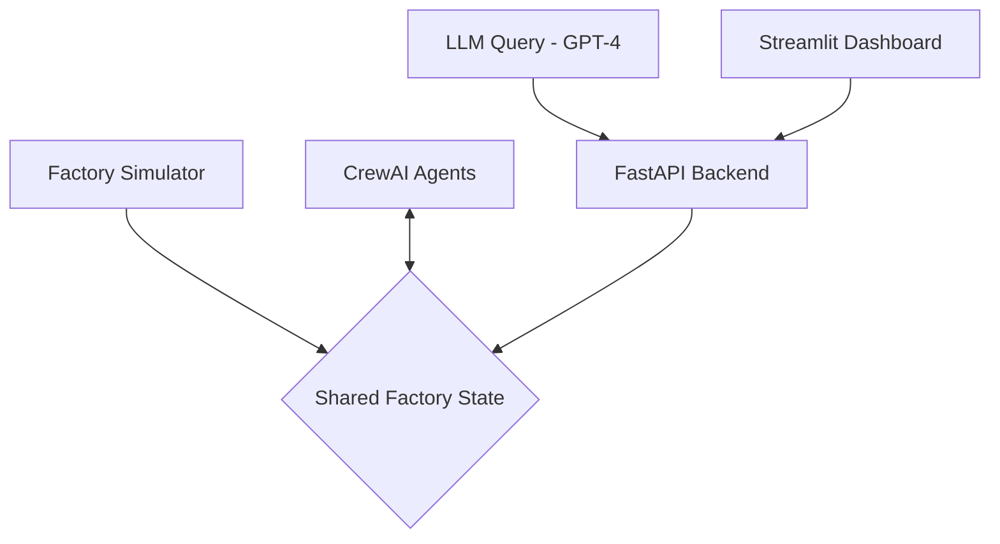

# AgentMesh: AI-Powered Smart Factory Assistant

An interactive digital twin of a smart factory powered by a multi-agent AI system. Ask natural language questions and get real-time, context-aware answers about your factory's operations.

---


*A live demo showing the dashboard monitoring machine status, alerts, and responding to user queries.*

---

## 📋 Overview

**AgentMesh** creates a dynamic, virtual replica of a factory floor where real-time machine and sensor data is continuously simulated. This "digital twin" serves as the single source of truth for a team of specialized AI agents built with **CrewAI**. These agents monitor production, inventory, and maintenance, logging their findings and decisions.

The core of the project is a natural language interface powered by **OpenAI's GPT-4**. A manager can query the system in plain English, and the AI will synthesize live data from the simulator and contextual analysis from the CrewAI agents to provide comprehensive, intelligent answers.

## ✨ Core Features

* **🏭 Real-Time Digital Twin:** A Python-based simulator (`FastMCP`) that streams live data on machine status, temperature, utilization, and inventory levels.
* **🤖 Multi-Agent System (CrewAI):** A team of specialized AI agents for:
    * **Production:** Monitoring machine workload and status.
    * **Inventory:** Tracking supply levels and flagging shortages.
    * **Maintenance:** Analyzing alerts to predict failures.
* **🧠 LLM-Powered Querying (GPT-4):** A natural language interface to ask complex questions about the factory's status, issues, and agent activities.
* **📊 Interactive Dashboard:** A Streamlit-based frontend to visualize live factory metrics, view active alerts, and interact with the AI assistant.

---

## ⚙️ System Architecture

The project follows a modular, event-driven architecture where components interact through a shared state, simulating a real-world data pipeline.


## 🛠️ Tech Stack

| Layer       | Technology         |
|-------------|--------------------|
| Simulation & Backend | Python, FastAPI       |
| AI Agents   | CrewAI              |
| LLM         | OpenAI GPT-4        |
| Frontend    | Streamlit           |
| Environment | python-dotenv       |

## 🚀 Getting Started

Follow these steps to set up and run the project locally.

### 1. Prerequisites

- Python 3.9 or above
- An OpenAI API key

### 2. Clone the Repository

```bash
git clone https://github.com/Omarthiside/-AgentMesh-AI-Powered-Smart-Factory-Assistant.git
cd agentmesh
```
3. Set Up the Environment
a. Create a .env File
Create a .env file in the root of the project directory and add your OpenAI API key:

env
Copy
Edit
OPENAI_API_KEY="sk-YourSecretApiKeyHere"
b. Install Dependencies
Install all the required Python packages using requirements.txt:

bash
Copy
Edit
pip install -r requirements.txt
4. Run the Application
You'll need two terminals:

🖥️ Terminal 1: Start the FastAPI Backend
This starts the backend server, simulator, and the CrewAI agent loop.

bash
Copy
Edit
uvicorn main:app --reload
Wait until you see:

mathematica
Copy
Edit
Application startup complete.
🖥️ Terminal 2: Start the Streamlit Dashboard
This launches the frontend UI:

bash
Copy
Edit
streamlit run dashboard.py
A new browser tab should open at:
http://localhost:8501

💡 How to Use
👀 Observe the Live Dashboard
Track real-time updates of:

Machine Status

Inventory Levels

Active Alerts

📋 Monitor Agent Logs
See the latest analysis from your CrewAI agents under "Latest Agent Logs".

💬 Ask Questions
Use the input box at the top to interact with the AI assistant. Try queries like:

"What is the current temperature of machine M001?"

"Summarize the overall status of the factory."

"Are there any active alerts I should worry about?"

"What was the last analysis from the Maintenance Engineer?"
📁 File Structure
```agentmesh/
├── .env                  # Stores API keys and environment variables
├── requirements.txt      # Project dependencies
├── factory_simulator.py  # Simulates the factory's digital twin
├── agents_and_tasks.py   # Defines the CrewAI agents and their tasks
├── llm_query.py          # Handles communication with the OpenAI LLM
├── main.py               # The FastAPI backend server
└── dashboard.py          # The Streamlit frontend application
```


