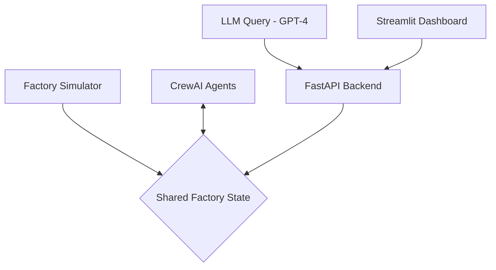

# AgentMesh: AI-Powered Smart Factory Assistant

An interactive digital twin of a smart factory powered by a multi-agent AI system. Ask natural language questions and get real-time, context-aware answers about your factory's operations.

---

*A live demo showing the dashboard monitoring machine status, alerts, and responding to user queries.*

---

## 📋 Overview

**AgentMesh** creates a dynamic, virtual replica of a factory floor where real-time machine and sensor data is continuously simulated. This "digital twin" serves as the single source of truth for a team of specialized AI agents built with **CrewAI**. These agents monitor production, inventory, and maintenance, logging their findings and decisions.

The core of the project is a natural language interface powered by **OpenAI's GPT-4**. A manager can query the system in plain English, and the AI will synthesize live data from the simulator and contextual analysis from the CrewAI agents to provide comprehensive, intelligent answers.

## ✨ Core Features

* **🏭 Real-Time Digital Twin:** A Python-based simulator (`FastMCP`) that streams live data on machine status, temperature, utilization, and inventory levels.
* **🤖 Multi-Agent System (CrewAI):** A team of specialized AI agents for:
    * **Production:** Monitoring machine workload and status.
    * **Inventory:** Tracking supply levels and flagging shortages.
    * **Maintenance:** Analyzing alerts to predict failures.
* **🧠 LLM-Powered Querying (GPT-4):** A natural language interface to ask complex questions about the factory's status, issues, and agent activities.
* **📊 Interactive Dashboard:** A Streamlit-based frontend to visualize live factory metrics, view active alerts, and interact with the AI assistant.

---

## ⚙️ System Architecture

The project follows a modular, event-driven architecture where components interact through a shared state, simulating a real-world data pipeline.

